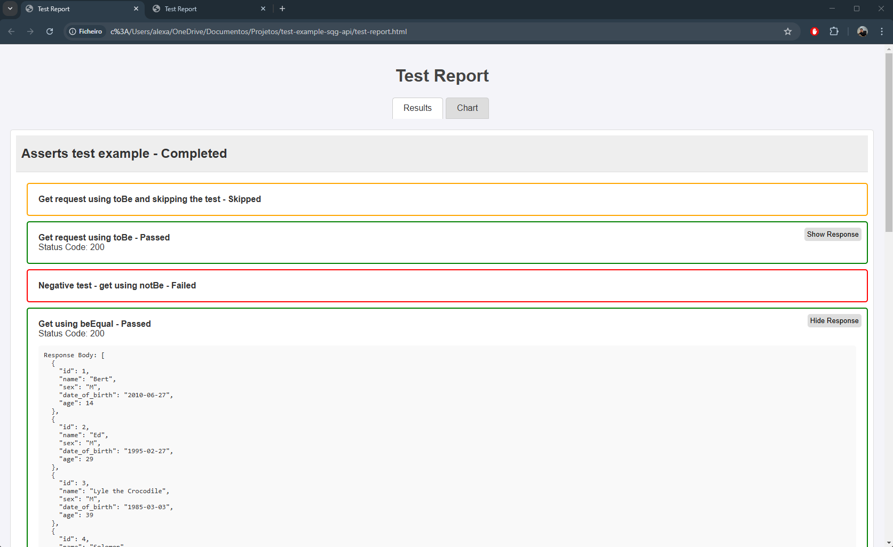
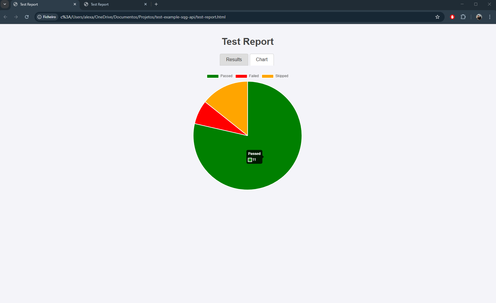

# test-example-sqg-api

- This project contain test examples about how to use the sqg-api framework.
- You can find the original project on this repository: https://github.com/AlexAlexandreAlves/sqg-api

## Installation Guide
First run to install the framework via npm:

```
npm install sqg-api
```

After run to install to install @types/node
```
npm i --save-dev @types/node
```

Now, let's create the tsconfig.json file:
```
{
  "compilerOptions": {
    "target": "ES2020",
    "module": "CommonJS",
    "outDir": "./dist",
    "rootDir": "./src",
    "strict": true,
    "sourceMap": true,
    "esModuleInterop": true,
    "skipLibCheck": true
  },
  "include": ["src/**/*", "tests/**/*"],
  "exclude": ["node_modules"]
}
```

- Finally set up the package.json file like that:

```
 "scripts": {
    "test": "ts-node node_modules/sqg-api/src/core/runner/runner.ts"
  },
```

## Getting Started

### 1. How to run your tests:

- We can use the next command to run all tests:
   
```
npm test
```

- Or we can use the next command to run a single test:
```
npm test {my-test-here.test.ts}
```


## Assertions

The framework allows the use of various assertions, comparing the actual result with the expected result. Below is a complete guide to using the assertions:

```toBe``` 
```notBe```
```beEqual```
```notBeEqual```
```beBiggerThan```
```beMinorThan```
```shouldExists```
```toContain```

You can find test examples in the framework in the test folder, like this:

```
testsuite('Asserts test example', () => {

    testcase('Get request using toBe', async () => {
        let req = request(BASE_URL).get('/public/crocodiles/');
        const response = await req.execute();

        expect(response.status).toBe(200);

        return { body: response.body, status: response.status };
    });
});
```

## Hooks
The framework has hooks that can be used like beforeEach, beforeAll, afterEach, and afterAll:

```
beforeEach(async () => {
    console.log('beforeEach executed');
});

```
## Test Methods 

Additionally, the project has some test methods that can be used to build your test suite quickly. These methods have a pre-setup and expect some data as parameters, for example:

```
  public async getList(route: string, statusCode: number, token?: string, content?: any, checkResponseMessage?: string) {
        let req = request(BASE_URL).get(route);

        if (token) {
            req = req.set('Authorization', `Bearer ${token}`);
        }

        const response = await req.execute();

        espera(response.status).toBe(statusCode);

        if (content) {
            espera(response.body).shouldExists();
            espera(response.body).toContain(content)
        }

        if (checkResponseMessage) {
            espera(response.body.message).toBe(checkResponseMessage);
        }

        return response;
    }
```

- As we can see, the test method is almost ready to use; we just need to provide the mandatory **baseUrl**, **route**, and **status code**. If you need to set up a **token**, you can define it in the method, updating the type of token you'll need to use, like Bearer or Basic auth.
  
- The **status code** is already being checked and compared with the status code returned in the request.
  
- The **content** parameter is the content body that you expect in the response. It isn't mandatory, but if provided, it will check the expected data and compare it with the response body in the request.

- The **checkResponseMessage** parameter is also not mandatory, but it is prepared to check and compare with the response message in the request.
  
- To use these methods, you just need to initialize an Entity class like this: ***const entity = new EntityService();***

## How to use the Test Methods

You'll be able to use five different types of almost ready Test Methods: **getById, getList, create, update, and delete.**

Follow the ***getList*** example below:


## How to use the Test Methods

You'll be able to use five different types of almost ready Test Methods: **getById, getList, create, update and delete.**

Follow the ***getList*** example bellow:

```
  testcase('Get testing with token authentication', async () => {
        await entity.getList('BASEURL/my/endpoint/', 200, token);
    });
```

## HTML Report
The framework has an HTML test report that will be created after the test execution. (The report is still in the improvement phase).





